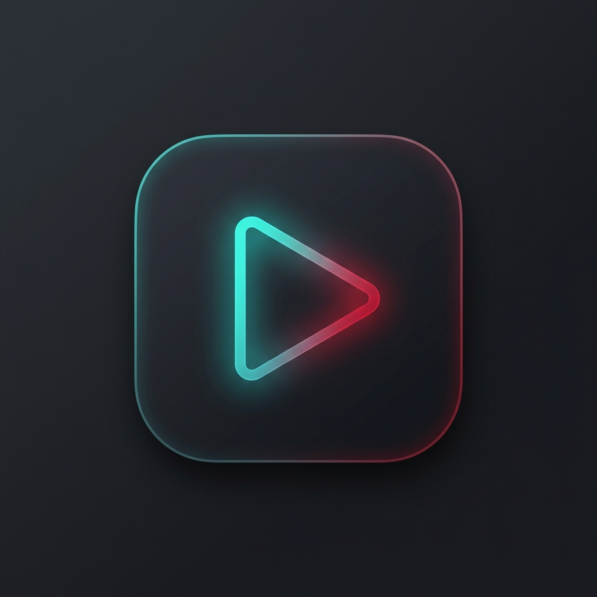

<div align="center">



# 🎬 LocalVancedYT
**The Ultimate Offline YouTube Experience for Windows**

*Zero Internet • Zero Tracking • Zero Accounts • 100% Local Freedom*

[](https://github.com/fahimarnob113-ctrl/LocalVancedYTXX/releases/latest)
[](https://github.com/fahimarnob113-ctrl/LocalVancedYTXX/releases/latest)
[](LICENSE)

<br/>

### ⬇️ **[DOWNLOAD LATEST RELEASE (.ZIP)](https://github.com/fahimarnob113-ctrl/LocalVancedYTXX/releases/download/v1.0.0/LocalVancedYT-v1.0.0-win32-x64-portable.zip)**
*(115 MB • Standalone Portable Windows Executable • No Installation Required)*

[**All Releases & Change Logs**](https://github.com/fahimarnob113-ctrl/LocalVancedYTXX/releases) • [**Report an Issue**](https://github.com/fahimarnob113-ctrl/LocalVancedYTXX/issues)

</div>

---

## ⚡ Quick Start (No Terminal / No Node.js Needed!)

1. **Download**: Click the **[Download Latest Release](https://github.com/fahimarnob113-ctrl/LocalVancedYTXX/releases/download/v1.0.0/LocalVancedYT-v1.0.0-win32-x64-portable.zip)** button above.
2. **Extract**: Unzip `LocalVancedYT-v1.0.0-win32-x64-portable.zip` anywhere on your PC (e.g. `C:\Games\LocalVancedYT` or your Desktop).
3. **Launch**: Double-click **`LocalVancedYT.exe`**.
4. **Add Your Media**: Click **`📁 Add Folder`** in the top bar, pick your video/movie/series directory, and start watching!

---

## 🌟 Why LocalVancedYT?

Online video streaming platforms constantly push algorithm clutter, ads, buffering, and account logins. **LocalVancedYT** brings the polished, modern, feature-rich interface of **YouTube + Vanced + Spotify** directly to your offline hard drive:
- **Never buffers**: Direct high-speed local disk streaming.
- **Never tracks**: Zero telemetry, zero analytics, zero network requests.
- **Organized like YouTube**: Shelves, channel avatars, tags, queues, playlists, resume progress, and timestamped notes.

---

## 📋 Comprehensive Feature Rundown

### 1. 🎛️ Studio-Grade YouTube Playback
- **Full 16:9 Video Canvas**: Ambient cinematic back-shadow, clean aspect ratio scaling, and immersive focus.
- **Hover Scrubber Bar**: Live gradient progress fill, animated hover scrub knob, buffer indicators, and precise `mm:ss` timestamp tooltips.
- **Transport Controls**: Play/Pause, ±10s fast skip (`J` / `L`), previous / next track in queue, and loop toggle.
- **Variable Playback Speed**: Instant speed switching between `0.25x`, `0.5x`, `0.75x`, `1.0x` (Normal), `1.25x`, `1.5x`, `1.75x`, and `2.0x`.
- **Subtitles & Closed Captions**: Load `.srt` or `.vtt` subtitles on the fly with automatic client-side SRT-to-WebVTT parsing.
- **Native Picture-in-Picture & Fullscreen**: Pop out videos into an OS floating window or watch in borderless fullscreen (`F`).

### 2. 🗂️ Watch Page 4-Tab Isolated Queue (No Video Drift)
When watching videos, the right-hand sidebar features 4 specialized tabs with **independent scroll isolation (`overscroll-behavior: contain`)** and a **sticky video player**. Scrolling through 1,000+ videos will **never** scroll the video off screen:
- **`📁 Folder Queue`**: Strict same-folder queue containing exclusively other media from the exact directory (no random mixing). Automatically auto-scrolls to the playing item.
- **`📋 Playlist Queue`**: Switch between your custom created playlists with track index badges and one-click removal.
- **`⏳ Manual Queue`**: Dynamic queue built with "+ Queue" buttons on cards. Seamless auto-playback prioritization: `Manual Queue` ➔ `Playlist` ➔ `Same Folder`.
- **`📌 Tagged Notes`**: Timestamped bookmarking engine. Click any note to jump directly to that playback second. Filter notes by `#hashtags` and export notes to a formatted `.txt` file.

### 3. 🎧 Spotify-Style Minimized Dock Player
- Minimizing from the Watch Page (`← Back to Browse` or `Esc`) keeps video/audio playing seamlessly with **zero interruption or re-buffering**.
- **Bottom 76px Acrylic Frosted Bar**:
  - **Left Zone**: Thumbnail preview, video title with hover marquee, channel name, and favorite star toggle.
  - **Center Zone**: Transport buttons (Previous, Play/Pause circular accent, Next, Loop, Shuffle) + full timeline scrubber with hover white knob, elapsed and total timestamps.
  - **Right Zone**: Volume slider with mute button, speed selector pill (`0.5x` - `2.0x`), expand back to full Watch Page (`⛶`), and close (`✕`).
- Dynamic page padding (`body.dock-active`) prevents the dock from ever obscuring your browse cards.

### 4. 🏷️ Category Tagging & Smart Filter Chips
- **Custom Tagging**: Assign categories to any media item (e.g. `#tutorial`, `#coding`, `#gaming`, `#music`, `#movie`).
- **Dynamic Home Chips**: Filter bar dynamically generates filter chips from all tags in your library.
- **Instant Search**: Type `#tag` or titles in the search bar for real-time live filtering with instant `✕` clear button and keyboard shortcut hint (`/`).

### 5. 🗑️ Media Culling & Disk Cleanup Manager
Safely audit and clean your storage without accidental data loss:
- **Smart Filter Presets**:
  - `Watched / Finished (>90%)`: Videos you've already completed.
  - `Large (>1 GB)` & `Medium (500 MB - 1 GB)`: Heavy storage hogs.
  - `Duplicate Suspects`: Media matching file sizes.
- **Storage Calculator**: Real-time counter showing total files and exact reclaimable disk space (e.g., *"Selected: 8 files • 6.4 GB"*).
- **Windows Recycle Bin Integration**: Deletions are sent via Electron `shell.trashItem()` directly to the **Windows Recycle Bin**, allowing 100% safe undo and recovery.

### 6. 🎨 60fps UI Polish & Themes
- **Hardware Acceleration**: Transitions use GPU-composited layers (`transform`, `opacity`, `will-change`) for silky-smooth 60fps scrolling across 1,000+ files.
- **Channel Gradient Avatars**: Dynamic circular avatar badges generated with high-contrast color gradients unique to each folder/channel.
- **Cinematic Card Micro-Zoom**: Cards smoothly lift (`translateY(-3px)`) while thumbnails subtly zoom (`scale(1.038)`).
- **4 Built-in Color Themes**:
  - 🌙 **YouTube Dark** (Default)
  - ☀️ **Clean Light**
  - ⚡ **Cyber Minimal**
  - 🖤 **AMOLED Pure**

### 7. 💾 Complete Portability & Dual Mode
- **1-Click Backup & Restore**: Export your entire watch history, playlists, favorites, and timestamped bookmarks to a single `.json` file and restore on any device.
- **Dual Architecture**:
  - **Native Desktop App**: Electron binary with native OS file dialogs and disk crawling.
  - **Browser Mode**: Open `index.html` in Chrome or Edge using HTML5 directory access and IndexedDB storage.

---

## ⌨️ Global Keyboard Shortcuts

| Shortcut | Action |
|---|---|
| <kbd>Space</kbd> or <kbd>K</kbd> | Play / Pause |
| <kbd>←</kbd> or <kbd>J</kbd> | Rewind 10 seconds |
| <kbd>→</kbd> or <kbd>L</kbd> | Fast forward 10 seconds |
| <kbd>F</kbd> | Toggle Fullscreen |
| <kbd>M</kbd> | Toggle Mute |
| <kbd>/</kbd> | Quick focus search bar |
| <kbd>Esc</kbd> | Minimize to Spotify dock / Back to browse |
| <kbd>Ctrl</kbd> + <kbd>D</kbd> | Toggle Debug HUD & activity console |

---

## 🛠️ Developer Setup & Building from Source

If you want to modify or compile the app yourself:

```bash
# 1. Clone the repository
git clone https://github.com/fahimarnob113-ctrl/LocalVancedYTXX.git
cd LocalVancedYTXX

# 2. Install dependencies
npm install

# 3. Launch in development mode
npm start

# 4. Package standalone Windows executable & portable ZIP
npm run build
```

Compiled binaries will be generated inside the `dist/` directory:
- `dist/LocalVancedYT-win32-x64/LocalVancedYT.exe`
- `dist/LocalVancedYT-win32-x64-portable.zip`

---

## 📄 License

Distributed under the **MIT License**. See `LICENSE` for more information. Built for offline freedom and local media preservation.

